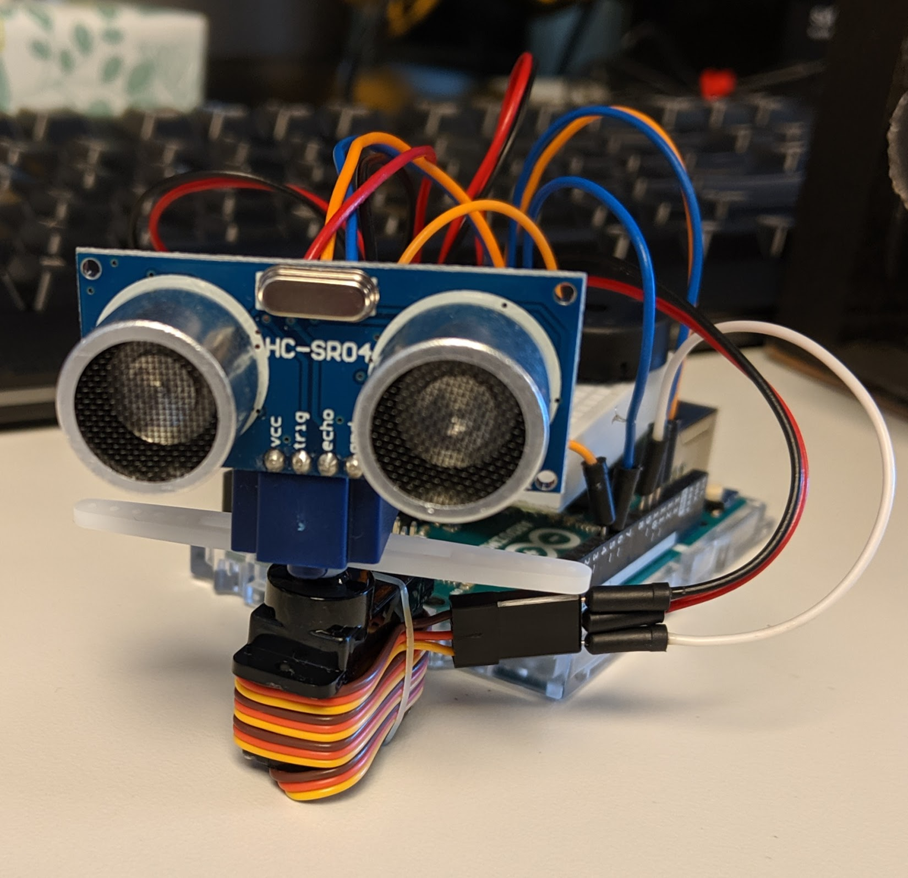

# Ashley the Robot

### Meet Ashley!

Ashley is a friendly little Arduino robot that can talk. Ashley can also sense the nearest object and turn to face that object.

 

## Design

- Base: Arduino UNO with Adafruit Proto Shield
- Eyes: Ultrasonic Distance Sensor
- Hands: Double Arm Servo Horn
- Body: Servo Motor
- Voice: Emic 2 Text-to-Speech Module
